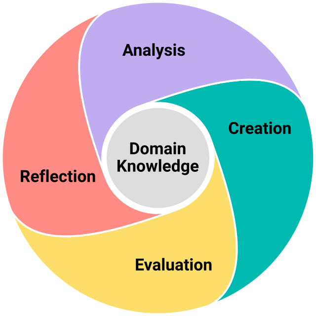

##### By Stephen Jones, Ph.D.
###### Updated October 2026

AI is automating white-collar work and transforming business functions. For customer service, 85% of service organizations use at least one form of AI, according to Salesforce, an enterprise software company. Klarna, a Swedish fintech, adopted OpenAI models to handle its customer service chats and saw immediate results. Its AI chat assistant managed 2.3 million conversations in one month, doing the work of 700 full-time agents. Resolution time fell from eleven minutes to under two. AI is also writing software, legal briefs, and consulting reports at remarkable speed. And it’s entering healthcare. Epic Systems, an electronic health records vendor, built a proprietary tool that scores hospitalized patients on their risk of sepsis, a life-threatening condition, and alerts clinicians when the risk needs addressing.

Some foresee a white-collar jobs apocalypse. But if AI follows past technological revolutions, it will transform work instead of destroying jobs. And however radical the transformation ultimately is, one thing will hold: businesses will still need employees who can think critically.

Managers have long sought out critical thinkers, and AI, if anything, amplifies the need for them—for AI often misses the mark and fails in ways that are hard to detect. Epic’s sepsis detector [proved faulty](https://jamanetwork.com/journals/jamainternalmedicine/fullarticle/2781307) at first. It missed two-thirds of patients who developed sepsis, and it flooded clinicians with false alarms: for every eight alerts, only one was real. AI writing can be faulty too. One law firm was sanctioned after two of its lawyers submitted a brief citing six cases fabricated by ChatGPT, complete with fictitious docket numbers and quoted reasoning. Deloitte Australia delivered a 234-page report to an Australian government agency that cited, ten times, *The Rule of Law and Administrative Justice in the Welfare State*, a book that does not exist. Even Klarna ran into trouble: service quality fell after widespread adoption of its chat assistant, and the company began hiring human agents back.

Better models will reduce these failures, but they won’t remove the need for critical thinkers. Someone must still specify business objectives, know the models’ weaknesses, judge their outputs, deploy them ethically, and answer for them.

Yet as AI advances, it threatens to dull the development of critical thinking. Early evidence is worrying. [One study](https://www.mdpi.com/2075-4698/15/1/6) of 666 people, spanning ages and education levels, found a negative relationship between frequent AI use and critical thinking ability. Cognitive offloading—the act of delegating strenuous thinking to AI—was the main reason.

Experimental evidence shows the same deleterious effect. [Researchers at Anthropic](https://www.anthropic.com/research/AI-assistance-coding-skills) had 52 software engineers complete an unfamiliar coding task and then quizzed them. Half of the engineers were allowed to use AI during the task and half weren’t. The AI group finished no faster than the non-AI group and scored worse on the quiz—nearly two letter grades lower.

The MIT Media Lab [found similar results for writing tasks](https://arxiv.org/abs/2506.08872). It had one group of students complete an SAT-style writing task with AI while another group used no tools. The researchers analyzed students’ writing, had teachers evaluate quality, monitored brain activity, and quizzed students on what they wrote. Those who used AI wrote two-thirds more than those who didn’t, but their answers were more homogeneous, and teachers described the AI-assisted essays as “soulless.” Students who used AI showed weaker brain connectivity and had poorer recall of what they wrote. They also felt less ownership of their work. The researchers concluded, “AI tools, while valuable for supporting performance, may unintentionally hinder deep cognitive processing, retention, and authentic engagement with written material. If users rely heavily on AI tools, they may achieve superficial fluency but fail to internalize the knowledge or feel a sense of ownership over it.”

This raises a dilemma: students and employees must use AI to stay relevant, but they risk impairing their critical thinking skills if they offload their cognitive work onto AI.

But evidence suggests there is a way forward. Impaired thinking is not inevitable—it depends on how AI is used. The Anthropic study found that engineers who asked AI conceptual questions and then wrote the code themselves did as well on the quiz as the control group. It was the engineers who delegated most of the coding who scored poorly. Similarly, students in the MIT study who wrote unaided before using AI engaged with it more strategically, showing better recall and stronger brain connectivity. And researchers who tracked 27,000 high-school students in China [found that those who used AI as a homework tutor](https://www.economist.com/graphic-detail/2026/08/18/does-ai-stop-children-from-learning)—instead of copying and pasting AI answers—did as well on exams as those who didn’t use AI.

This *Critical Thinking in the Age of AI* series introduces a thoughtful approach to AI—one that raises productivity while still building the capacity to think. This first article introduces critical thinking and the ACER framework. The second introduces the five intellectual dispositions for critical thinking and the third introduces AI roles and reactions.

## Critical Thinking in Business

Critical thinking is *disciplined reasoning to form warranted beliefs and defensible decisions*. Critical thinkers use their skills in three ways. First, they evaluate claims of truth, sifting out those that are unwarranted, meaning they lack adequate justification. Claims are made constantly in business, and many sound plausible. But claims are warranted only when they rest on good evidence and sound reasoning. They fail when they start with faulty information or use poor logic.

Progressive has advertised that “drivers who switch and save with Progressive save over $900 on average.” This claim is true, and carefully bounded (lest Progressive run afoul of regulators). But the implied conclusion—that a driver who switches will save $900—isn’t warranted. The statistic is based on a group of switchers who aren’t representative. The group includes only drivers who were paying too much before switching; it doesn’t include drivers who found Progressive more expensive and stayed put. Any particular driver may already have a competitive rate and shouldn’t expect such savings. Yet insurers advertise such claims because many consumers jump to the unwarranted conclusion.

Second, critical thinkers answer business questions by turning raw data into reasoned answers—ones justified by more than gut feel. They analyze datasets of customer complaints, financial results, and competitors’ prices to describe relationships in the data, and they infer answers from the relationships.

In 2024, TikTok users accused Chipotle of shrinking its portions, but the CEO denied it. So Wells Fargo analyst Zachary Fadem decided to settle the debate: was the company telling the truth, or skimping on chicken? He and his team ordered the same burrito bowl 75 times across eight New York locations and weighed each one. The median was 1.3 pounds, but there was wide variance: some locations served roughly a third more than others, and the heaviest bowl weighed nearly twice the lightest. Fadem concluded that Chipotle hadn’t systematically shrunk portions—the analysis supported the CEO’s claim—but individual restaurants were skimping. The company ultimately conceded it had an execution problem at some locations.

Third, critical thinkers choose appropriate courses of action while facing ambiguity. An organization’s future is uncertain and its present is complex, so making good decisions is hard. Critical thinkers cut through ambiguity to get at the heart of a situation and craft well-reasoned arguments to convince others of the path forward.

In 2001, Steve Jobs announced that Apple would open its own retail stores. It was a questionable move at the time. No computer maker had succeeded in retail, and computer margins were thin, requiring high sales just to cover the rent. BusinessWeek ran a commentary titled “Sorry, Steve: Here's Why Apple Stores Won't Work.”

Jobs could not prove his skeptics wrong. But he could improve his chances of getting it right. He hired consultants to study why the retail strategy at Gateway, a computer maker, had failed. He recruited executives from the Gap and Target, conceding that he knew nothing about retail. And before opening a store, he built a full-sized prototype inside a rented warehouse and iterated on the design. Six months in, his retail chief convinced Jobs the entire layout was wrong, and they began again. By the time the first two stores opened, the concept had been tested for a year. Ultimately, Apple Stores became the highest-grossing retail space per square foot in America.

## ACER Framework

Evaluating claims, answering questions, and choosing actions require four types of thinking, which I call cognitive modes: analysis, creation, evaluation, and reflection. These four modes make up the ACER framework. Though the modes are presented in order here, a skilled critical thinker moves fluidly among them for any reasoning task. Each mode has a [set of skills](#APPENDIX) that has expanded in our AI age to include AI-specific skills.

ACER skills help resolve the AI dilemma. By applying them, students and employees can boost productivity while continuing to learn.

### Analysis

Analysis is the act of decomposing a problem, phenomenon, or argument into its basic elements, identifing how those elements relate to each other, and locating evidence that bears on the question at hand. Analysis asks: what is this made of, how do the pieces connect, and what evidence do we have? It includes recognizing patterns, sequences, and relationships in data; identifying what information is relevant and why; and naming what is unknown or missing.

Fadem settled the shrinking burrito bowl debate using analysis skills. He first decomposed the problem into its parts: ingredients, location, order channel (digital versus in-store), and weight. He fixed the order to six ingredients, so the only thing that could vary was the amount of each ingredient in the bowl, not the ingredients themselves. This created a reliable measure for portion size. Then he collected evidence from the eight locations. He examined relationships between weight and location and between weight and order channel, since customers suspected digital orders were being shorted. The channel data showed no difference, eliminating one explanation. But the location data showed a relationship with weight, which fed into Fadem’s conclusion.

Analysis converts a confusing, complex situation into something workable. Without analysis, reasoning rests solely on intuition, which is less reliable. Analysis is also foundational for creation, which generates new insights and compelling arguments.

AI accelerates analysis tasks—retrieving information, identifying patterns, and mapping relationships quickly. But AI lacks access to private, local, or contextual information. Unless supplied, firsthand observations, proprietary data, and situational knowledge are invisible to it. Effective analysis with AI requires knowing what AI doesn't know—and deciding what to feed in.

### Creation

Creation is the act of producing new knowledge and sound decisions from the relationships analysis reveals. It also plays a role before analysis begins, first framing the right question or proposition. It moves from individual elements to the whole. Creation asks: given what I know, what follows? It includes generating inferences from evidence, explaining causes and predicting outcomes, often under uncertainty, and ultimately constructing arguments and models that integrate evidence and reasoning into something that didn't exist before. Creation turns analysis into insight.

But creation is also susceptible to poor reasoning. Inferences can exceed the evidence, or they may be biased by personal motives. Arguments can be poorly constructed by over- or under-weighting evidence.

In 2011, Netflix decided to split its DVD rental and online streaming businesses. At the time, a subscription included both DVDs by mail and the streaming service, but Netflix’s CEO, Reed Hastings, inferred that DVDs would decline in the future and streaming would dominate. Hastings reasoned that splitting the businesses would let streaming grow unhampered by declining physical rentals. He moved DVDs to a separate site called Qwikster and required customers to keep two accounts and pay two bills. His inference about the changing rental market was accurate, but his argument underweighted how much customers valued having one subscription. Netflix lost 800,000 subscribers in a single quarter, and its stock fell roughly 75% over the following months. Hastings killed Qwikster in three weeks.

AI can expand creative possibilities—producing inferences, explanations, and arguments to seed more sophisticated thinking. Used well, it functions as a catalyst, supplying raw material for novel ideas. But AI output arrives polished and complete, not looking like raw material, which creates a subtle pull to treat it as a finished product rather than a starting point. Effective creation with AI requires thoughtful prompting and then doing the generative work—using AI to spur thinking, not substitute for it.

### Evaluation

Evaluation is the act of scrutinizing—applying standards, criteria, and logical principles to judge the quality of reasoning, evidence, and argument. It assesses whether premises hold, whether inferences are warranted, and whether arguments are strong or weak. Evaluation asks: how good is this reasoning, and how do I know? It includes judging outputs against explicit criteria, weighing evidence for and against a claim, identifying hidden assumptions and biases, distinguishing stronger from weaker arguments, and steelmanning positions—making the best case for them—before critiquing them. Evaluation applies to one’s own reasoning and to others’.

Evaluation leads to better inferences and arguments. Without evaluation, it’s easy to create exciting claims that are spectacularly wrong. Evaluation is the quality control of critical thinking—it catches the unwarranted leap, the hidden assumption, the weak evidence dressed up as strong support. It is also the cognitive mode most directly threatened by motivated reasoning: people are naturally inclined to evaluate their own arguments charitably and others’ harshly. This is why evaluation must be paired with reflection.

AI output must be evaluated like any other source, and in some ways more carefully. AI is fluent and confident even when its reasoning is poor. Its reliability also depends on the data it was trained on, which is worth assessing. And before any of this, it’s important to choose the role AI should have in a thinking task, if any—a choice that depends on the task’s cognitive demands, the desired outcome, and one’s own learning goals.

Steven Schwartz, the lawyer whose brief cited six fabricated cases, had practiced law for thirty years when he turned to ChatGPT for research help. Nothing in the output looked suspicious. When opposing counsel could not locate the cases, Schwartz did not open Westlaw, the authoritative caselaw database. He asked ChatGPT whether the cases were real. It said yes. He pressed further, and it produced what appeared to be screenshots of the decisions, which he filed with the court. Schwartz failed to evaluate twice. He never judged the output against an independent standard. (Checking a source against itself isn’t verification.) And he never judged AI’s role. Westlaw was on his desktop, yet he assigned a record-retrieval task to an AI text-generation tool. He testified that it had never occurred to him the tool could invent cases.

### Reflection

Reflection is thinking about one’s own thinking. While the other three modes are directed outward—at problems, evidence, and arguments—reflection is directed inward, at the reasoning process itself. Reflection, which is also called metacognition, asks: how well am I thinking, and should I be reasoning differently? Reflection watches for gaps and inconsistencies in one’s reasoning, notices when emotions or social pressure are distorting one’s judgment, and calibrates confidence in one’s conclusions.

Reflection is what makes the other three modes self-correcting. It is the feedback loop that converts experience into learning and mistakes into improvement. Without it, reasoning errors are easily repeated. In this sense, reflection is the mode that monitors and protects the integrity of the others.

After Klarna’s CEO, Sebastian Siemiatkowski, acknowledged the company’s chatbot had lowered customer service quality, some concluded that the deployment had fallen short. But Siemiatkowski, reflecting on his own evaluation criteria, reached a different conclusion. Cost, he said, had been too predominant a factor in the assessment. The AI had performed spectacularly on the metrics it was given. The error was in what Klarna had chosen to measure, a judgment he was responsible for.

AI introduces additional reflection needs. Do I know enough about this domain to judge the output? Have I internalized this idea, or can I only use it with AI's help? Has AI reframed the problem without my noticing? And reflection guards against the central temptation—offloading cognitive work when reasoning becomes uncomfortable—by asking: am I using AI to accelerate my learning, or to avoid hard thinking? It also serves those reluctant to use AI at all: am I avoiding it where it would genuinely help?

### Domain Knowledge

ACER skills are general: they can be used in situations within and outside of business. But domain knowledge is needed to use them well. A marketing manager with deep knowledge of a target audience can critically evaluate a proposed advertising campaign better than an intern. And a strategist can more easily identify patterns in a complex industry after many years working in it. Domain knowledge thus sharpens critical thinking.

Domain knowledge also improves judgment of AI output. AI is fluent and confident even when it's wrong, which can cause a novice to err. Expertise is needed to spot an error within a fluent answer.

Domain knowledge improves reflection too. Experts notice when AI is subtly reshaping their thinking, and can decide whether to accept it. They also judge their own learning more accurately. A fluent explanation can feel like understanding, so novices may assume they have internalized more than they have.

---

## APPENDIX

**ACER Critical Thinking Skills**

***Analysis***

1. Decompose a problem, phenomenon, or argument into its basic elements or constituent concepts.
2. Determine how to measure or operationalize a concept.
3. Identify patterns, sequences, or relationships among data or elements.
4. Identify sources of information that may answer a question or be evidence for a claim.
5. Assess whether information is irrelevant or is evidence for or against a claim.
6. Identify what is unknown or missing for answering a question or evaluating a claim.
7. **[+AI]** Identify private, local, or contextual information that AI lacks.

***Creation***

1. Frame a problem, proposition, or question of interest.
2. Generate a warranted inference from evidence.
3. Predict an outcome from patterns, relationships, or evidence.
4. Generate an explanation or infer the cause of a problem or phenomenon.
5. Use assumptions and estimates to produce a claim when evidence is limited.
6. Construct a novel argument or model using logic, evidence, and inferences.
7. **[+AI]** Use AI-generated ideas or arguments as raw material for original thinking.
8. **[+AI]** Construct prompts that give AI context, constraints, and direction to produce its output.

***Evaluation***

1. Judge the quality of an output using a set of criteria.
2. Assess whether a premise holds, a logical statement is valid, or an inference is warranted.
3. Weigh the logical and evidentiary support for and against a claim or argument.
4. Identify implicit assumptions, limitations, or biases in reasoning or an argument.
5. Distinguish between stronger and weaker forms of an argument.
6. Construct the strongest version of a position (steelman) before critiquing it.
7. **[+AI]** Evaluate which AI role is appropriate, if any, given the cognitive demands, desired outcomes, and learning goals of a task.
8. **[+AI]** Assess how data or training limitations affect the reliability of AI output.

***Reflection***

1. Assess whether you have sufficient understanding to reason about a topic.
2. Monitor your reasoning for logical gaps or internal inconsistencies.
3. Recognize when emotions, personal investment, or social pressure are affecting your reasoning.
4. Calibrate your confidence in a conclusion to the actual strength of your evidence and reasoning.
5. Recognize when your current reasoning approach isn’t working and adjust your strategy.
6. Reflect on the quality of your own reasoning process and identify what could be improved.
7. **[+AI]** Notice when AI reframes or anchors your thinking in a new way.
8. **[+AI]** Assess whether you have sufficient domain knowledge to critically evaluate AI’s claims.
9. **[+AI]** Recognize when you are using AI to avoid discomfort or cognitive effort.
10. **[+AI]** Assess whether your AI use or lack thereof is improving or hampering your learning.
11. **[+AI]** Assess whether you have internalized ideas or arguments that AI introduced or whether you are reliant on AI to use them.
