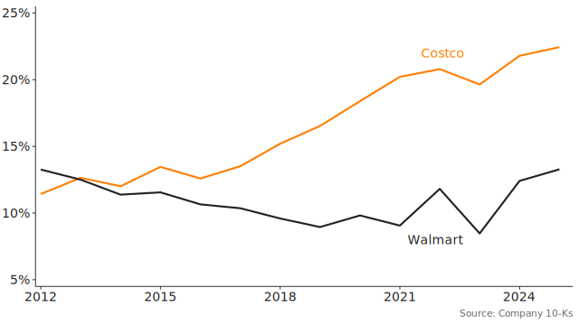

<h4 style="font-family: var(--font-family-san-serif); font-weight: 600;">BACKGROUND NOTE</h4>

# Profitability analysis
#### Analyzing a firm’s profitability can reveal its strategy — and how well it’s working.


##### By Stephen Jones, Ph.D.
###### Updated December 2020

STRATEGISTS WANT TO KNOW whether their firm’s strategies are leading to superior performance. To find the answer, they analyze their firm’s profitability and compare it to the firm’s historical performance and to the performance of the firm’s rivals. Profitability analysis allows them to evaluate and improve their firm’s strategies.

This background note will explain a useful way to conduct profitability analysis. It will detail important profitability ratios and explain how to calculate them. It will also explain how a firm’s profitability ratios link to its strategies. 

## Strategy and profitability analysis
Analysts often evaluate a firm’s profitability to determine its value for the purpose of investment. For example, mutual funds value firms to decide whether to buy or sell shares. Investment bankers value target firms on behalf of their clients who are seeking to acquire the targets. And private equity partners value firms to determine which candidates are attractive for buyouts. 

But strategists analyze their firm’s and competitors’ profitability for different reasons. The goal of strategists is to improve their firm’s performance by enacting better strategies. They benchmark against past performance and competitors’ performance to determine which strategies are working and which are not. Analyzing performance can also reveal enacted strategies that have not been publicized but are important for the firm’s success.

When analyzing profitability, strategists separate performance related to operating decisions from performance related to financing decisions and focus on the former. Operating decisions — such as opening a new plant, launching a marketing campaign, or reorganizing business units — directly relate to the core activities of a firm. Financing decisions — such as whether to raise capital by issuing debt or equity — are critical as well, but they are removed from the analysis to get a clearer picture of how operational strategies affect performance.

## Profitability and return on invested capital
There are different metrics that you can use to measure profitability. Common metrics include return on equity (ROE) and return on assets (ROA). However, this article will focus on a different metric: return on invested capital (ROIC). ROIC is, theoretically, the metric that best captures operating profits generated by capital invested in the firm. But ROIC is a non-standard measure, meaning there are some judgments about what to include or not include when constructing the metric. (I’ll present a common method to calculate ROIC, but it’s not the only one.)

ROIC is an efficiency ratio that describes how well a firm transforms an input (i.e., invested capital) into an output (i.e., profits due to operations). It’s usually expressed as a percentage. For example, a 20% ROIC means that for every dollar invested, the firm generates 20 cents of profit from its operations. Because ROIC is a percentage, analysts can compare in a fair way the profitability of differently-sized firms. 

To explain ROIC below, I’ll discuss common items on firms’ income statements and balance sheets. Items found on these financial statements are printed in monospace font when they are introduced in the article.


### Calculating ROIC
Figure 1 presents the ROIC ratio and many other ratios associated with it. (I’ll refer to this figure throughout the article.) ROIC for a given year t is calculated as the net operating profit after tax (NOPAT) in year t divided by the average invested capital (IC) in year t. Average IC is calculated as the mean of the IC at the end of year t and year `t-1`. The formula is:
```
ROIC_t = \frac{NOPAT_t}{average\ IC_t} = \frac{NOPAT_t}{(IC_t + IC_{t-1})/2}
```
For example, Costco’s NOPAT in 2020 was $4.11 billion, and its IC in 2020 and 2019 was $24.43 billion and $22.94 billion, respectively. So Costco’s ROIC in 2020 was:
```
Costco\ ROIC_{2020} = \frac{NOPAT_{2020}}{(IC_{2020} + IC_{2019})/2} = \frac{4.11}{(24.43 + 22.94)/2} = 17.4\%
```
This means that for every dollar invested, Costco generated 17.4 cents in profit from its operations.

**Net operating profit after tax (NOPAT).** NOPAT captures a firm’s profit generated by its operating decisions. It’s calculated using items on a firm’s income statement. The formula for calculating NOPAT at year `t` is:
```
NOPAT_t = operating\ profit_t\times(1-effective\ tax\ rate_t)
```
The basis for NOPAT is operating profit, which is also called ``operating income`` or ``earnings before interest and taxes`` (EBIT).[^1] Operating profit excludes profit and loss items pertaining to financing decisions. In contrast, ``net income`` (which also captures profit) includes interest expense and ``non-operating income and expenses``; it’s not used in the ROIC calculation because it combines items related to operating and financing decisions. 

However, operating profit does not account for all operations-related items in an income statement. Tax expenses also affect a firm’s profit and are directly related to its operations. So taxes need to be accounted for as well. But there is a problem with simply subtracting taxes from operating profit. In the U.S., companies reduce their taxable income by their interest expenses. This means that there is a tax advantage to issuing debt versus issuing equity. So our analysis would be biased, for example, if we simply subtracted taxes from operating profit to compare a firm that finances its business with debt to one that relies only on equity. The debt-financed firm would look more profitable even if the two firms had the same operating profit. In essence, a financing decision (i.e., the choice to finance with debt versus equity) would bias our comparison of the two firms’ operating decisions.[^2]

The NOPAT calculation above skirts this issue by applying the effective tax rate directly to the operating profit. It allows for an apples-to-apples comparison of different firms regardless of their financing decisions. 

A firm’s effective tax rate is calculated as ``provision for taxes`` divided by ``earnings before taxes`` (not EBIT), which are both listed on a firm’s income statement.[^3] The effective tax rate is expressed as a percentage. By using the effective tax rate, NOPAT adjusts taxes such that taxes are calculated as if a firm was financed entirely by equity. Adjusted taxes is calculated as the operating profit multiplied by the effective tax rate. Thus, NOPAT in year `t` can also be expressed as:
```
NOPAT_t = operating\ profit_t-adjusted\ taxes_t
```
For example, Costco’s operating profit in fiscal year (FY) 2020 was $5.44 billion, its earnings before taxes was $5.37 billion, and its provision for taxes was $1.31 billion. Costco’s effective tax rate was $1.31 ÷ $5.37 = 24.4%. Its adjusted taxes were $5.44 × 24.4% = $1.33. So Costco’s NOPAT (in billions) in 2020 was:
```
Costco\ NOPAT_{2020} = \$5.44-\$1.33 = \$4.11
```
The $4.11 billion NOPAT calculated here was used in the calculation of Costco’s ROIC above.

**Invested capital (IC).** IC is a measure of a firm’s capital employed in its operations with an implied or express expectation of a return. Not all capital that a firm holds is used in its operations. For example, Apple held $192 billion and Microsoft held $123 billion in ``cash`` and [``marketable securities``](https://www.investopedia.com/terms/m/marketablesecurities.asp) at the end of their 2020 fiscal years. But they only use a small fraction of that cash in their day-to-day operations. Most of it simply sits in accounts earning a small return. Additionally, not all capital that a firm possesses is truly invested. For example, Costco held $14 billion in accounts payable at the end of FY 2020. The $14 billion represents capital Costco can use in its operations but is owed to its suppliers. Suppliers, however, are not Costco investors; they don’t receive a return by letting Costco hold their capital. ROIC only focuses on capital that’s invested and employed.

The items needed to calculate IC are found on a firm’s balance sheet. The formula for calculating IC at the end of year `t` is:[^4] 
```
IC_t = total\ assets_t-NIBCLs_t-excess\ cash_t
```
``Total assets`` is simply total assets on the balance sheet. Because ROIC and ROA both use total assets in their denominators, they are close cousins. But ROIC excludes certain items (i.e., NIBCLs and excess cash) that ROA does not.

NIBCLs stands for non-interest-bearing current liabilities. They are current liabilities (due within one year) that have no implied or express return for the liability holders. (In contrast, interest-bearing current liabilities, such as the ``current portion of long-term debt`` do provide a return and are included in invested capital.) NIBCLs include items such as ``accounts payable``, ``taxes payable``, ``unearned revenue``, ``accrued wages payable``, and other accrued liabilities. They represent capital belonging to suppliers, governments, customers, or employees held by the firm for a short period of time. Although they are only held briefly, NIBCLs can be a large portion of a firm’s capital base. For example, the value of Costco’s NIBCLs was 45% of its total assets in 2020. Because NIBCLs aren’t considered invested capital, their value is subtracted from total assets. 

Excess cash is cash held by a firm that’s not employed in its operations. It’s theoretically clear but is difficult to quantify because it’s not found on the balance sheet. A firm normally needs cash [equal to 2% to 5% of annual sales](https://plus.credit-suisse.com/rpc4/ravDocView?docid=P8BJ3Y) to run its daily operations, so a common way to estimate excess cash is to choose a percentage based on the nature of the firm and its industry.[^5] A stable firm in a stable industry might only need cash equal to 2% of sales. A growing firm in a volatile industry might need cash equal to 5% of sales (or more).

At the end of FY 2020, [Costco held $13.31 billion](https://www.sec.gov/ix?doc=/Archives/edgar/data/909832/000090983220000017/cost-20200830.htm) in cash and short-term investments (which are liquid like cash) and had sales of $166.76 billion. Assuming Costco needed cash equal to 4% of sales to support its continued growth, its needed cash in 2020 was $166.76 × 4% = $6.67 billion. Thus, Costco had $13.31 − $6.67 = $6.64 billion in excess cash.[^6] At the end of the prior fiscal year, Costco had $3.34 billion in excess cash.

At the end of FY 2020 and 2019, Costco had $55.56 and $45.40 billion in total assets and had $24.75 and $21.54 in NIBCLs, respectively. So Costco’s invested capital (in billions) at the end of 2020 and 2019 was:
```
Costco\ IC_{2020} = \$55.56-\$24.49-\$6.64 = \$24.43
```
```
Costco\ IC_{2019} = \$47.82-\$21.54-\$3.34 = \$22.94
```
The FY 2020 and 2019 ICs calculated here were used to calculate Costco’s FY 2020 ROIC above.

Sometimes it’s useful to express the average IC differently. To show how, we first separate total assets in the IC formula into three types of assets: (a) ``current assets``; (b) ``net property, plant, and equipment`` (PPE); and (c) other assets such as ``goodwill`` and ``intangible assets`` that affect operations. Next, we can subtract NIBCLs and excess cash from current assets to calculate a firm’s net working capital (NWC) at the end of year `t`:
```
NWC_t = current\ assetst-NIBCLs_t-excess\ cash_t
```
Note, this is a non-standard formula for NWC. Usually it’s calculated as ``current assets`` less ``current liabilities``. But we use this formulation because it fits within the ROIC framework and highlights a firm’s cash conversion from its operations. A lower number — even going negative — suggests more efficient working capital management. For example, keeping inventories low and selling goods before suppliers’ invoices for those goods become due can lead to negative NWC and indicates the firm is using suppliers to finance their operations interest free.

Thus, invested capital at the end of year t can be expressed as the sum of NWC, net PPE, and other assets:
```
IC_t = NWC_t+net\ PPE_t+other\ assets_t
```
And the average (avg.) IC in year `t`, which is the average of `IC_t` and `IC_{t-1}`, can be expressed as:
```
avg.\ IC_t = avg.\ NWC_t+avg.\ net\ PPE_t+avg.\ other\ assets_t
```
For example, Costco’s NWC was −$3.01 billion and −$1.39 billion at the end of FY 2020 and 2019, respectively, so Costco’s average NWC in 2020 was (−$3.01 + −$1.39) ÷ 2 = −$2.20 billion. Costco had a negative average NWC because it often collects cash for its sales before it pays its suppliers. Further, Costco collects membership fees when annual memberships begin and pays out its 2% executive membership rewards when membership years end.

Costco’s net PPE was $24.59 billion and $23.31 billion at the end of FY 2020 and 2019, respectively, so its average net PPE was ($24.59 + $23.31) ÷ 2 = $23.95 billion. And Costco’s other assets were $2.84 billion and $1.02 billion for the same years, so its average other assets were ($2.84 + $1.02) ÷ 2 = $1.94 billion. Thus, Costco’s average IC (in billions) in FY 2020 was:
```
Costco\ avg.\ IC_{2020} = −\$2.20+\$23.95+\$1.94 = \$23.69
```

### ROIC Benchmarks
In FY 2020, Costco’s ROIC was 17.4%, but does that mean Costco was highly profitable or doing poorly? To know, we need to compare Costco’s ROIC to a meaningful benchmark. Three common benchmarks are:

1. A competitor’s ROIC
2. A firm’s historical ROIC
3. The average ROIC in a firm’s industry

Walmart is a good competitor benchmark for Costco. They’re in the same industry and both are regarded as excellent grocery and general retailers. Walmart’s ROIC for its year ending January 31, 2020, was 9.5%. That means Costco returned 7.9 cents more than Walmart for every dollar invested, suggesting that Costco is highly profitable. 

Figure 2 shows Costco’s and Walmart’s ROIC over time. Benchmarking Costco’s historical performance, we find that Costco improved its profitability over time. In 2012, Costco’s ROIC was 11.4%, so it improved its profitability by 6 cents per dollar invested in nine years. In contrast, Walmart’s ROIC has trended downward over the same time period.



Additionally, Costco’s ROIC was much better than the industry average ROIC. Costco is a grocery and general merchandise retailer ([NAICS code 452311](https://www.census.gov/cgi-bin/sssd/naics/naicsrch?code=452311&search=2017%20NAICS%20Search)). According to [Aswath Damodaran of New York University](http://pages.stern.nyu.edu/~adamodar/New_Home_Page/datafile/mgnroc.html), the industry average ROIC for grocery retail was 7.1% and general retail was 13.8% in the U.S. in 2020, which puts Costco above the averages. Overall, Costco’s performance was better than Walmart’s, it increased over the prior nine years, and it was much better than the industry averages. All of these comparisons show that Costco is a superior performer.

### ROIC and economic value creation
A positive ROIC does not necessarily mean that a firm is creating economic value. This is because investors expect a return on their investments, which represent financial costs to a firm, but these costs do not appear in the ROIC calculation. Costs to access capital are associated with financing decisions which, by design, are excluded from ROIC. For a firm to create economic value, its ROIC must be greater than its cost of capital.[^7] For example, Costco created economic value in 2020 because its ROIC was higher than its cost of capital, which was 4.2% [according to Guru Focus](https://www.gurufocus.com/term/wacc/NAS:COST/WACC-/Costco-Wholesale). 

In contrast, Skullcandy, a [maker of headphones and rooted in extreme sports](https://www.skullcandy.com/inside-skullcandy), did not create economic value before it was [taken private by Mill Road Capital](https://www.globenewswire.com/news-release/2016/10/03/876636/0/en/Skullcandy-Closes-Going-Private-Transaction-with-Mill-Road-Capital.html) in 2016. Skullcandy’s cost of capital was 7.2% in FY 2015 but its ROIC was only 4.6%, which was 2.6% lower than its cost of capital. Thus, while Skullcandy’s operations were profitable, it actually destroyed economic value because it did not generate sufficient profits to meet its cost of capital.

## Going deeper: Return on sales and capital turnover
A firm’s ROIC will tell you how profitable the firm is, but it won’t tell you why. It’s only the starting point for understanding how a firm’s strategies are affecting its profitability. The next step is to calculate a firm’s return on sales and capital turnover, as shown in Figure 1. These two ratios give different views into why a firm is profitable or not.

### Return on sales
Return on sales measures of a firm’s operating efficiency. It’s the percentage of revenues that, after subtracting expenses related to operations, become profit. It’s an operating efficiency measure because a firm’s return on sales is higher when the firm is able to control or lower its operating costs. 

The formula for return on sales in year `t` is:
```
return\ on\ sales_t = \frac{NOPAT_t}{sales_t}
```
Return on sales uses the same numerator as ROIC, but instead of dividing NOPAT by invested capital, NOPAT is divided by ``sales`` or ``revenues``. For example, recall that Costco’s NOPAT in FY 2020 was $4.11 billion on revenues of $166.76 billion. So its return on sales was $4.11 ÷ $166.76 = 2.5%, which means 2.5% of Costco’s revenues converted to profit.

### Capital turnover
Capital turnover measures a firm’s capital efficiency and is usually expressed as a dollar amount. It’s the amount of revenue generated per dollar of invested capital. A firm that generates more sales than a rival on the same one dollar of invested capital will have a higher capital turnover.

The formula for capital turnover in year `t` is:
```
capital\ turnover_t = \frac{sales_t}{average\ IC_t}
```
Capital turnover uses the same denominator as ROIC, but the numerator is sales instead of NOPAT. For example, recall that Costco’s capital turnover in FY 2020 was $23.69 billion. So its capital turnover was $166.76 ÷ $23.69 = $7.04, which means every dollar of invested capital generated $7.04 in revenue.

### Relationship with return on invested capital
The combination of return on sales and capital turnover has a direct mathematical relationship with ROIC:
```
ROIC_t = \frac{return\ on\ sales_t}{capital\ turnover_t}
```
Expanding the return on sales and capital turnover ratios shows why this relationship holds. Multiplying the two produces the original ROIC calculation:
```
ROIC_t = \frac{NOPAT_t}{sales_t} \times \frac{sales_t}{average\ IC_t} = \frac{NOPAT_t}{average\ IC_t}
```
This relationship shows that increasing either return on sales or capital turnover will increase return on invested capital. For example, if a firm lowers its material costs to increase its operating efficiency, it will increase its return on sales and ultimately its ROIC. Or if a firm improves the utilization of its manufacturing plants to increase its capital efficiency, it will increase its capital turnover and its ROIC. 

Further, a firm with a negative return on sales will have a negative ROIC. In this case, if the firm increased its capital turnover without improving its return on sales, it would exacerbate its operating inefficiencies and drive its ROIC even more negative. A firm with a negative return on sales must address its operating inefficiencies first.

### Benchmarks
Like ROIC, return on sales and capital turnover can be benchmarked against rivals’ metrics, historical metrics, or industry average metrics. Benchmarking these metrics provides analysts with their first insight into _why_ a firm’s ROIC is good or poor. If a firm’s return on sales diverges from the benchmark return on sales, then operating efficiency — and strategies associated with it — help explain a firm’s better or worse profitability. Likewise, if a firm’s capital turnover diverges from the benchmark capital turnover then capital efficiency and capital efficiency strategies explain the profitability differences.

For example, recall that Costco’s ROIC was better than Walmart’s. Costco’s higher profitability could be driven by Costco’s operating efficiency or capital efficiency or both. By comparing return on sales, we find that operating efficiency does not explain Costco’s higher ROIC: Costco’s return on sales in FY 2020 was 2.5%, which was lower than Walmat’s 3.0% return on sales. Instead, capital efficiency explains the difference in profitability: Costco’s capital turnover of $7.04 dwarfed Walmart’s capital turnover of $3.20. 

This analysis allows us to narrow our focus on what’s driving Costco’s success. From here, we can consider Costco’s strategies that allow it to use its capital so efficiently. 

## Going even deeper: Expense, asset, and unit-based ratios
Once analysts have calculated return on sales and capital turnover, they can go even deeper by analyzing why a firm’s operating or capital efficiency is good or poor. To understand the reasons for a firm’s operating efficiency, we can calculate various expense ratios using the income statement (see Figure 1). And to better understand a firm’s capital efficiency, we can calculate asset ratios using the balance sheet. 

While return on sales and capital turnover are applicable to nearly all companies, specific expense and asset ratios are particular to an industry. This is because the nature of expenses and assets differ from one industry to the next. The ratios I show here in the retail sector may be different than the ratios that are useful in, for instance, the airline industry or the high tech sector. Thus, it is important to first understand how an industry uses assets and generates expenses. Then you can calculate the expense and asset ratios that are applicable to your industry. 

### Expense ratios
Expense ratios help explain why a firm’s operating efficiency is good or poor. An expense ratio is calculated by taking an operating expense — such as ``cost of goods sold`` (COGS) or ``selling, general, and administrative`` (SGA) — from the income statement and dividing it by sales. A lower expense ratio indicates greater operating efficiency. In the retail sector, common ratios include “COGS over sales” and “SG&A over sales”.

Like other ratios we’ve calculated, expense ratios can be benchmarked against rivals’ ratios or a firm’s historical performance. For example, Costco’s COGS over sales in FY 2020 was 86.9% compared to Walmart’s 75.3%. Thus, one reason Walmart had better operating efficiency was that its product costs relative to sales was lower. On the other hand, Costco’s SG&A over sales was only 9.8% compared to Walmart’s 20.8%. This shows that Costco was much better at keeping its overhead expenses low.

Expense ratios directly relate to return on sales. If an expense ratio increases, then a firm’s return on sales will decrease, and vice versa. This can be shown by expanding the return on sales formula. First, we can expand NOPAT in the numerator into operating profit less adjusted (adj.) taxes:
```
return\ on\ sales_t = \frac{NOPAT_t}{sales_t} = \frac{operating\ profit_t - adj.\ taxes_t}{sales_t}
```
Then, we can expand operating profit into sales less the income statement’s operating expenses. For the retail sector, we’ll assume that there are only two operating expenses: COGS and SG&A. Thus, the return on sales formula becomes:
```
\frac{operating\ profit_t - adj.\ taxes_t}{sales_t} = \frac{sales_t - COGS_t - SG\&A_t - adj.\ taxes_t}{sales_t}
```
This expression can be further reorganized to show that return on sales in year `t` is:
```
return\ on\ sales_t = 1-\left(\frac{COGS_t}{sales_t}+\frac{SG\&A_t}{sales_t}+\frac{adj.\ taxes_t}{sales_t}\right)
```
For example, Costco’s return on sales in FY 2020 can be expressed as:
```
Costco\ return\ on\ sales_{2020} = 1-(86.9\%+9.8\%+0.8\%) = 2.5\%
```
This formulation of return on sales makes it easier to see that as any expense ratio (such as COGS over sales) increases, return on sales will decrease.

### Asset ratios
Asset ratios explain why a firm’s capital efficiency is good or poor. An asset ratio is calculated by taking an asset item from the balance sheet and dividing it by sales. A lower asset ratio indicates greater capital efficiency. In the retail sector, common ratios include “average NWC over sales” and “average net PPE over sales”. 

Costco’s average NWC over sales in FY 2020 was −1.3% compared to Walmart’s −1.5%. This suggests that Costco’s greater capital efficiency is not due to better working capital management. Walmart had a lower average NWC over sales ratio. But Costco’s average net PPE over sales at 14.4% was lower than Walmart’s at 23.8%. This indicates that Costco is able to use less property to generate each dollar of sales.

Asset ratios decrease capital turnover when the asset ratios increase, similar to how expense ratios affect return on sales. This can be shown by expanding the capital turnover formula. First, capital turnover in year t can be expressed as the inverse of average IC over sales:
```
capital\ turnover_t =  \left(\frac{avg.\ IC_t}{sales_t}\right)^{-1}
```
Recall that average IC can be expressed as the sum of average NWC, average net PPE, and average other assets. Thus, capital turnover can be expressed as:
```
capital\ turnover_t = \left(\frac{avg.\ NWC_t}{sales_t}+\frac{avg.\ net\ PPE_t}{sales_t}+\frac{avg.\ other\ assets_t}{sales_t}\right)^{-1}
```
For example, Costco’s capital turnover in FY 2020 can be expressed as:
```
Costco\ capital\ turnover_{2020} = (−1.3\%+14.4\%+1.2\%)^{-1} = \$7.04
```
If the sum of the ratios increases, then its inverse will decrease (and vice-versa). Thus, lowering the asset ratios increases capital turnover and ultimately ROIC.

### Unit-based ratios
All of the ratios introduced so far have been dollar denominated, meaning they either have sales dollars or invested capital dollars as the denominator. However, insights into profitability, operating efficiency, and capital efficiency can also come from ratios denominated in sales units or asset units. For example, in the airline industry, capital efficiency is often expressed as revenue per available seat mile. It’s calculated by dividing an airline’s total revenue by the total number of miles every seat in every plane flew in a year (regardless of whether there was a passenger in it). Further, airline operating efficiency can be expressed as cost per passenger mile, which is calculated by dividing operating expenses by the total number of miles every passenger was flown in a year. In retail, capital efficiency is often expressed as revenue per store or revenue per square foot. Stores and square feet are important asset units for physical retail. Profitability in retail can also be expressed as NOPAT per store or NOPAT per square foot. 

Unit-based ratios often complement dollar-denominated ratios and add additional insight. But data for unit sales or asset units can be difficult to get, so using them depends on available information. And the types of units that are meaningful will differ among industries. Still, they are useful metrics if you can calculate them.

## Analyzing profitability: Costco vs. Walmart
Figure 1 captures the various ratios we’ve discussed. Profitability analysis normally begins at the top of Figure 1 and works downward, exploring branches where the firm’s ratios diverge from the benchmark’s ratios. When the ratios diverge, it gives analysts the opportunity to reflect on the firm’s or competitor’s strategies to understand why the ratios differ. It also provides strategists opportunities to see whether the firm’s strategies are having the expected effect on performance. For example, if executives enacted a new strategy to improve operating efficiency but operating efficiency hasn’t improved over time, then the firm may need to revisit its strategy.

To illustrate, I’ll analyze Costco’s performance in FY 2020 with Walmart as the competitor benchmark, as shown in Figure 3. My analysis will be brief. Much more could be said beyond what I analyze here, but it will illustrate how you can connect strategy to profitability.


First, we ask, which firm was more profitable? Based on Figure 3, we answer: Costco. Costco’s ROIC was 17.4% compared to Walmart’s ROIC of 9.5%. The next question is, why? The answer is because Costco’s capital efficiency was better than Walmart’s. Costco’s capital turnover was $7.04 compared to Walmart’s $3.20, meaning Coscto generated $3.84 of revenue more than Walmart for every dollar invested. (In contrast, Costco’s return on sales was lower, suggesting Walmart has higher operating efficiency.)

The next question is, why was Costco’s capital efficiency higher? To answer, we point to Costco’s average net PPE over sales, which was 14.4% compared to Walmart’s 23.8%. (Remember that lower asset ratios indicated better capital efficiency.) We can also highlight Costco’s revenue per square foot of retail space, which was $1,450 per square foot in FY 2020 compared to Walmart’s $464 per square foot. Costco is much better at using its stores to generate revenue.

Next we ask, what strategies has Costco adopted vis-à-vis Walmart that allows its capital to be so efficient? We can point to a couple of strategies. First, Costco sells in bulk quantities, which increases the revenue from each customer visit. Thus, a busy Costco will generate more revenue than a busy Walmart simply based on bulk sales. Second, Costco only sells high-volume merchandise. In contrast, Walmart sells many products to make it a one-stop shop. But that means many of Walmart’s products are lower volume. Thus, Walmart is unable to generate the same level sales using a similar store footprint.

In other words, the difference in capital efficiency points to differences in strategy: Costco’s strategies center on high sales volumes of a few products. Walmart’s strategies center on the convenience of one-stop shopping.

Now that we’ve created a link between strategy and performance — that is, a high-volume strategy leads to higher capital efficiency — we can begin to think about how changes to Costco’s strategies might change performance. For example, if Costco wanted to sell more products to be more convenient, what would happen to its performance? Our analysis suggests that Costco’s capital efficiency would fall (because its new products would have lower volumes relative to its current products) and its profitability would suffer. However, Costco could sell seasonal products (which have lower average volumes) without hurting its capital efficiency if it sold them only during the products’ seasons of high demand. Indeed, Costco uses this strategy to sell camping equipment during the summer and hot chocolate mixes during the winter.

## Summary
Strategists analyze their firm’s profitability to understand how their firm’s strategies lead to superior performance or underperformance. Profitability is measured as return on invested capital (ROIC) and is benchmarked against (1) a competitor’s ROIC, (2) a firm’s historical ROIC, or (3) the average ROIC in a firm’s industry. To understand why a firm is performing well or not, profitability can be separated into operating efficiency and capital efficiency. Operating efficiency is concerned with how to keep costs low so that more of every revenue dollar can convert to profit. In other words, it is focused on minimizing expenses. Capital efficiency is concerned with how much revenue every dollar of invested capital generates. It is focused on asset utilization. Operating and capital efficiency can be further divided into detailed expense ratios and asset ratios that provide greater insight. Unit-based ratios also complement these ratios. Overall, the strategists’ goal is to understand how their firm’s strategies drive profitability.

---

[^1]. Operating profit is sometimes adjusted when calculating NOPAT. For example, [impairments to long-lived intangible assets](https://www.investopedia.com/ask/answers/101314/what-are-differences-between-amortization-and-impairment.asp) (which are operating expenses) are normally excluded from the calculation. 

[^2]. Here is an example: Firm A and Firm B both have an operating profit of $100 and a 20% tax rate. Firm A is financed by debt and pays $40 in interest. Firm B is financed by equity and pays no interest. Firm A’s taxable income is $100 − $40 = $60. Firm B’s taxable income is $100. Firm A’s operating profit less taxes is $100 − ($60 ⨉ .20) = $88. But Firm B’s is only $100 − ($100 ⨉ .20) = $80. 

[^3]. Sometimes when calculating NOPAT, using the effective tax rate can be problematic. For example, airlines, which have a history of magnificent losses, can apply [net operating loss carryforwards](https://www.investopedia.com/terms/l/losscarryforward.asp), which can create negative effective tax rates and make NOPAT hard to interpret. In such cases, you can simply use operating profits (before taxes) or apply a historical average effective tax rate. Whatever adjustment is used, it should be used to calculate the NOPAT all firms being compared.

[^4]. Sometimes [``goodwill``](https://www.investopedia.com/terms/g/goodwill.asp) is also subtracted from total assets. Whether to do so depends on how frequently a firm acquires other companies, the nature of the industry, and the purpose of the analysis. If goodwill is subtracted from total assets, it should be done for all firms being compared.

[^5]. The formula is: `\textrm{max}(0,\ cash_t − sales_t \times p)`, where `\textrm{max}` is the maximum function and `p` is a chosen percentage (e.g., 2%). Alternatively, excess cash can be consider any cash that’s not needed to cover a firm’s current liabilities less non-cash current assets. The alternate formula is: `\textrm{max}(0,\ cash − \textrm{max}(0,\ current\ liabilities − current\ assets + cash))`.

[^6]. Using the alternative method in footnote 5, Costco’s excess cash was `\textrm{max}(0,\ \$13.31 − \textrm{max}(0,\ \$24.84 − \$28.12 + \$13.31)) = \$3.28` billion.

[^7]. In the case of debt, such as corporate bonds or bank loans, the cost of capital is the coupon or interest rate for the debt. In the case of equity, the cost of capital in the implied rate of return expected by shareholders. A firm’s cost of capital is normally based on its [weighted average cost of capital](https://www.investopedia.com/terms/w/wacc.asp).