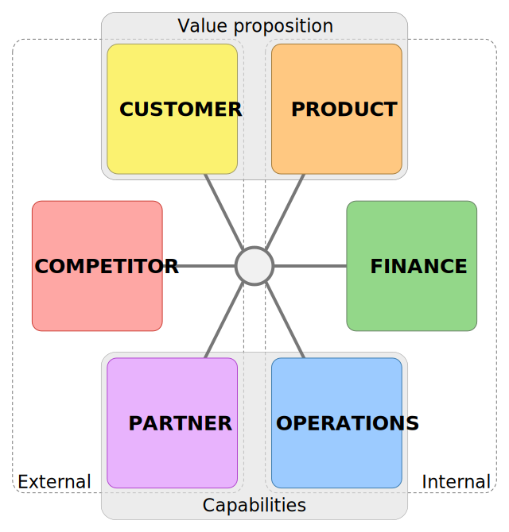

##### By Stephen Jones, Ph.D.
###### Updated March 2026

NO SINGLE STRATEGY makes a firm successful, but it is tempting to believe that myth. Commentators like to tell simple stories about why firms win. Some, for example, say Apple’s competitive advantage stems from its industrial design team. Others mention the late Steve Jobs’ imprint on the company. Still others highlight its brand strength. Any one of these explanations is appealing, but each is inadequate by itself.

In reality, winning firms craft a host of strategies that fit seamlessly together. Their competitive advantages stem from a suite of cohesive firm choices⁠—not just one. 

Fit is key to Apple’s success. Its elegant iPhones, Macs, and iPads appeal to status-conscious professionals and creatives, and because they interoperate fluidly, they are more valuable together⁠—creating a walled garden that deepens loyalty and keeps rivals at bay. Apple extends this coherence across every dimension of its business. No single choice accounts for its success⁠—the power lies in how its choices reinforce one another. This focus on fit generates tremendous profit⁠—Apple’s net income topped $112bn in 2025.

Generating strategies that fit together is challenging. Myopia keeps leaders from seeing the broad consequences of their choices, leading to unforeseen problems. A marketing decision may derail manufacturing. Or a product strategy may incite a damaging response from rivals. To avoid such problems, it is crucial to understand a strategy’s implications beyond its target.

The strategy components framework helps with this. It highlights the ramifications of certain choices and points out roadblocks. It prods decision-makers to think more carefully and creatively about strategy combinations. The framework does not substitute for building strategy; it augments the process, helping shape a cohesive suite of choices. It ensures good strategies reinforce and amplify one another, making them great together. 

## The strategy components framework
The framework has six core components: customer, product, finance, operations, partner, and competitor. These components, shown in Figure 1, capture the fundamental domains of business strategy common to all firms. They address questions related to who to serve, how to serve them, what capabilities to build or buy, how to compete against rivals, and how to generate profits. 

The product, finance, and operations components are internally focused. The customer, competitor, and partner components focus on external actors. A firm’s value proposition is captured by the customer and product components. Its capabilities are defined by the operations and partner components.

The strategy components framework is related yet distinct from a business model. Both offer a comprehensive representation of a firm, but they highlight different things. Business models try to tell a [good story](https://hbr.org/2002/05/why-business-models-matter) about how a firm works or explain the system of interconnected activities that “[determines the way the company ‘does business’](https://sloanreview.mit.edu/article/creating-value-through-business-model-innovation/).” But business models often mix tactical details in with strategic decisions and ignore important aspects of competition⁠—creating a blurry strategic picture. The strategy components framework, in contrast, makes the strategic picture clearer by focusing solely on key strategies and how they interact.

### Customer component
The customer component asks, “Who is our customer?” It describes the types of customers the firm will target and *not* target. Targeting choices may be based on geography, demographics, psychographics, or [the jobs a customer needs done](https://hbr.org/2016/09/know-your-customers-jobs-to-be-done).

Frontier Airlines, for example, prides itself on knowing what ultra-price-sensitive flyers are willing to give up for lower ticket prices. Those outside its target segment might find its service [appalling](https://www.tripadvisor.com/Airline_Review-d8729213-Reviews-Frontier-Airlines), but Frontier knows which consumers will be drawn in by its rock-bottom fares. Its steady focus on the ultra-low-cost segment steers all of its strategies.

Netflix, in contrast, wants everyone in the world to sign up for its service. Yet Netflix is just as focused on knowing its customers as Frontier, if not more so. Netflix [tracks nearly every user action](https://neilpatel.com/blog/how-netflix-uses-analytics/) on its site. It sifts through its trove of customer data to understand subscribers’ interests and [sorts them into niches](http://theconversation.com/the-unique-strategy-netflix-deployed-to-reach-90-million-worldwide-subscribers-74885). Netflix’s insights steer its content choices.

### Product component
The product component asks, “What defines our products and services?” It includes strategies related to product design, quality, market positioning, pricing, sales channels, customer relationship management, and technology roadmaps.

The product strategy of the Ritz-Carlton, a luxury hotel chain, is foremost concerned with customer service. Employees greet guests by name with genuine smiles before escorting them to their opulent rooms. Every employee is a brand ambassador, and the company’s [Gold Standards](https://www.ritzcarlton.com/en/about/gold-standards) encourage them to fulfill “even the unexpressed wishes and needs of our guests.” The Ritz even gave employees specific scripts to ensure that guests had pleasant exchanges with staff. But when the scripts made conversations too robotic, [it dropped them](https://www.forbes.com/sites/micahsolomon/2015/09/24/your-customer-service-style-is-your-brand-the-ritz-carlton-case-study/#2c1f6f3d55ef) and taught employees how to personalize exchanges to make them warm and authentic.

Alignment between product and customer strategies creates customer value. The combined strategies reveal how a product fulfills a target customer’s wants and needs, which makes for a good value proposition. Netflix presents customers curated content personalized just for them, which helps viewers find the shows they like. Frontier’s low fares and à la carte pricing let those on a tight budget fly, opening up air travel to more people. And the Ritz-Carlton gives wealthy guests an immersive luxury experience. This customer-product alignment is crucial. Misaligned components can be disastrous⁠—just imagine Frontier trying to serve Ritz-Carlton’s patrons or the Ritz-Carlton offering Frontier-like room service.

### Finance component
The finance component spells out a firm’s profit formula, defining its aims for profit margin (earnings per unit) and sales volume. A profit formula translates a value proposition into revenue projections and capabilities into cost projections. It is tied to a firm’s approach to value composition, as explained in “[Strategic Avenues to Superior Performance](https://stephen-l-jones.github.io/articles/strategic-avenues-to-superior-performance).” The finance component also includes a firm’s strategy for capital expenditures and tapping capital markets.

Netflix’s profit strategy follows the [value-creation avenue](https://stephen-l-jones.github.io/articles/strategic-avenues-to-superior-performance#2-value-creation-avenue). Early on Netflix quickly added content, which is the primary source of customer value, while slowly raising prices. Its content grew 26% annually from 2015 to 2021, but its prices rose only 6% per annum. This increased consumer surplus, leading to rapid subscriber growth. Then Netflix adjusted its strategy toward capturing more of the value it created. Its content growth slowed to a trickle⁠—only 2% annually over the next four years⁠—while its prices rose at the same 6% per annum. This marked an important pivot in Netflix’s profit formula: it transitioned from low margins with rapid subscriber growth to higher margins with slower subscriber growth.

But profitability doesn’t always translate into sufficient liquidity. Netflix had a voracious appetite for cash during its content acquisition binge in the 2010s. The company pays for content before the content generates revenue, so while Netflix had an operating profit of $2.6bn in 2019, it had a negative [free cash flow](https://www.investopedia.com/terms/f/freecashflow.asp) of $3.3bn. To cover the deficit, Netflix primarily tapped debt markets. Interest rates were low and debt was inexpensive at the time. By the end of 2019, it had nearly $21bn in debt (mostly corporate bonds) and paid over $600m in interest for the year. After its 2021 pivot, Netflix’s free cash flow turned positive (mirroring its profits) by going on a content acquisition diet. Still, Netflix must carefully decide how much capex to allocate and what financial markets to tap if profits won’t cover the spending.

### Operations component
A firm can only deliver its promised product if its internal capabilities are up to the task. Strategies in the operations component ensure that they are. They focus on acquiring, building, and maintaining capabilities that create customer value⁠—and on ensuring that capabilities are efficient so that costs stay low.

Capabilities are housed in a firm’s functions⁠—marketing, sales, engineering, production, human resources, and others⁠—and in its management structure. They include technical capabilities (such as designing a smartphone) and management capabilities (such as creating a culture of accountability). A firm needs both types.

Chick-fil-A has built customer service capabilities that regularly earn it the [highest satisfaction scores](https://theacsi.org/industries/restaurant/quick-service-restaurants/) among quick-service restaurants. Store managers ingrain a “second mile service” philosophy in their employees, encouraging them to exceed customers’ expectations. Team members carry trays to tables, walk the drive-thru line to take orders during busy periods, and respond to every thank you with “my pleasure.” To maintain its service level, Chick-fil-A selects its franchisees with unusual care, [accepting less than 1% of applicants](https://www.cnbc.com/2018/12/14/less-than-1-percent-of-people-who-apply-get-to-open-a-chick-fil-a.html) and requiring each to run only a single location. Unlike most chains, which sell franchises to multi-unit investors, Chick-fil-A chooses operators the way it chooses employees: for character, work ethic, and commitment to service. This selectivity ensures that its service culture is not merely corporate policy but something genuinely practiced at every counter. 

Chick-fil-A’s popularity created drive-thru headaches, so the company launched a “film studies” unit to shorten lines and wait times. Inspired by NFL sideline replay analysis, the special unit deployed drones to capture aerial footage of drive-thru traffic, which it spliced with kitchen video to diagnose bottlenecks. Operators reviewed the footage with a headquarters team the way a coach reviews game film with players. The insights drove tangible results: at one Rockford, Illinois location, [drive-thru transactions rose 50%](https://www.wsj.com/business/hospitality/chick-fil-a-drive-through-service-fast-food-innovation-ed5e2288) after a film study identified staffing gaps and a Wi-Fi dead zone. Combined, these technical and management capabilities help Chick-fil-A deliver a customer experience that stands apart from its fast-food peers.

### Partner component
Firms cannot succeed in isolation⁠—it is too difficult to sustain all the capabilities needed to deliver a promised product. So firms build relationships with strategic partners who fill in the capabilities they lack. The partner component addresses how firms build and leverage those relationships.

Strategic partners can be suppliers, resellers, or contractors. For example, Amazon relies on a network of small businesses to handle the “last mile” of package delivery⁠—the final leg from a local warehouse to a customer’s door. Rather than hiring its own drivers or building a massive fleet, Amazon recruits independent operators to run delivery routes using Amazon-branded vans. Amazon supplies the vans, route-optimization software, and packages; the independent operators hire the drivers and manage day-to-day operations. This has let Amazon rapidly scale its delivery capacity with little capital investment. The same is true for Uber. It lowers its costs by hiring gig workers to do the driving. It considers itself a technology platform company, not a taxi service. 

Firms can also ally with rivals⁠—using joint ventures or industry consortia⁠—to share risks and advance common interests. Qualcomm, Huawei, Nokia, and other competitors work together in [3GPP](https://www.3gpp.org/), a global consortium that builds and maintains mobile phone protocols, including 4G LTE and 5G. Engineers from these firms submit technical solutions that advance the standards. In 2025, 3GPP began work on 6G with aims to dramatically increase speeds and embed AI in mobile networks.

Partners can also be municipalities or government agencies. For example, Boeing relies on the Federal Aviation Administration (FAA), a U.S. government agency, to certify its aircraft. Boeing needs the FAA’s permission to get any new aircraft off the ground. In March 2019, the FAA grounded all 737 MAX planes after two fatal crashes, leading to a $1bn loss for Boeing in the fourth quarter of that year. Boeing fixed its planes, and the FAA permitted the 737 MAX to fly again after a 20-month hiatus.

Together, the operations and partner components govern investments in capabilities. The capabilities, in turn, drive a firm’s costs and determine whether the firm will realize its value proposition. Choosing between internal and external capabilities is an important strategic decision as well.[^1] Building internal capabilities offers more control but increases costs and risks. Leveraging external capabilities does the opposite. Firms continually balance the two.

### Competitor component
The competitor component answers the question, “How do we handle competitive threats?” It encompasses strategies that differentiate a firm from its rivals and that counteract rivals’ moves. Competitor strategies also seek to keep potential entrants out.

Competitor strategies try to steer rivals’ behavior. Best Buy, for example, prominently advertises a price-match guarantee⁠—a promise to match any competitor’s price on the same product. On the surface it looks like a consumer promotion, but its deeper purpose is competitive signaling. It warns rivals that undercutting Best Buy on price won’t work: if a competitor drops its price, Best Buy matches it, meaning the rival captures no customers but sacrifices its own margin. Knowing this, rivals have little incentive to start a price war. The result is that Best Buy enjoys more stable, higher prices⁠—without actually having to match many prices at all.

Competitor strategies also protect against new entrants. General Mills and WK Kellogg Co, two American cereal makers, fill untapped niches that cereal startups might enter. They keep a close eye on consumer trends and make sure they have a product for every taste. When Kellogg noticed a consumer desire for cereals that support a healthy gut, it released [HI! Happy Inside](https://www.forbes.com/sites/arielknoebel/2018/11/20/kelloggs-new-cereal-has-your-insides-in-mind/#34db138e1d69). The 2018 product launch promoted the cereal’s fiber, probiotics, and prebiotics. General Mills responded similarly to the later rise of high-protein diets, launching Cheerios Protein in 2024⁠—a direct answer to consumers who had been gravitating toward protein shakes and Greek yogurt for breakfast. The move aimed to stop the drift away from cereal and to keep any new protein-focused cereals from gaining a foothold.

### Putting it together: Apple
Apple has key strategies in each component, as shown in Figure 2. Apple targets professionals and creatives globally who want easy-to-use, beautiful, status-oriented personal devices. It ignores price-conscious consumers. Apple matches these customer strategies with product, positioning, and pricing strategies. It produces smartphones, laptops, and watches that work seamlessly together and positions them as refined, intuitive, and aspirational. It offers an endless variety of apps developed by third parties. And it prices at a premium and assiduously avoids discounting to maintain its brand image.

Apple has invested deliberately in its operations component to support its customer and product strategies. Apple’s design and marketing capabilities create aesthetically appealing devices. Its honed culture of innovation helps it continually release enhancements and new features. But Apple doesn’t do everything itself. It relies on the manufacturing prowess of strategic suppliers and the creativity of third-party app developers. By leveraging its partners’ capabilities, Apple can focus on its core strengths.

Apple’s competitor component is helped by its product and operations strategies. Apple creates switching costs to protect against defection. Switching costs arise from Apple’s integrated ecosystem and brand strength, making it difficult for customers to leave. Apple also carefully avoids bleeding-edge technologies, which are experimental innovations with risky customer uptake. This means Apple is rarely first to the market. BlackBerry sold personal digital assistants with full keyboards before Apple introduced the iPhone. Microsoft introduced a tablet PC before Apple’s iPad. Apple instead learns from rivals’ forays into new tech, waits until the tech can meet its exacting brand standards, and then pounces⁠—capturing mass audiences.

Apple, in its finance component, aims to generate large margins, high volumes, and strong free cash flow⁠—made possible by the other components. Its premium value proposition drives strong demand. It captures the value it creates through high prices. And it reduces costs through economies of scale⁠—aided by strategic partners. It then reinvests free cash into innovative projects and brand maintenance.

None of these strategies, by itself, creates Apple’s success. They only become a compelling whole when combined.

## Strategic fit
Netflix’s 2013 release of [*House of Cards*](https://www.youtube.com/watch?v=SvSkxBYuoQY), a political drama, signaled its advance into originals, which in turn transformed the entertainment industry’s competitive landscape. 

Prior to *House of Cards*, media production and delivery were split. Major studios like Disney, Warner Bros., and Paramount produced content, and [MVPDs](https://en.wikipedia.org/wiki/Multichannel_television_in_the_United_States) like Comcast and Dish delivered it to U.S. households. When Netflix began streaming in 2007, it followed the model of existing distributors: license movies and TV shows from studios using fixed-fee contracts and exclusive rights. This traditional approach put Netflix on good terms with its content partners. 

So why did Netflix launch its own production studio and upend the industry? The answer lies in two principles of component fit: the principle of interdependence and the principle of options and constraints.

### Principle of interdependence
Strategic choices have wide-reaching effects beyond their primary goal. Strategies can create unforeseen challenges and follow-on opportunities, which expose underlying interdependencies among strategy components.

Such interdependencies reshaped Netflix’s distribution-only model, which had worked well until it entered streaming. Through its streaming site, Netflix began collecting data on every subscriber action, including what they watched, when they stopped, and what they searched for. It analyzed this trove to gain insight into subscribers’ viewing interests, eventually learning to serve up content tailored to hyper-niche tastes. 

This subscriber intelligence became valuable, and studio partners lacked it⁠—so Netflix knew what viewers wanted better than studios. Rather than share the insights, which would undermine their competitive value, Netflix decided to exploit them directly.

Netflix knew the studios would perceive this strategic shift as a direct attack. From the studios’ point of view, Netflix had become a streaming behemoth. Netflix had over 44 million streaming subscribers by the end of 2013 and was adding millions every quarter. Its increasing size was giving Netflix ever-greater bargaining power in licensing negotiations. Netflix knew of the studios’ fears, so it knew it needed to increase production quickly. It had to build its production capabilities before the studios could build their own streaming distribution and curtail Netflix’s bargaining power. As CEO [Reed Hastings put it](https://www.fool.com/investing/2017/12/16/3-times-netflix-ceo-reed-hastings-predicted-the-fu.aspx), “The goal is to become HBO faster than they can become us.”

This cascade of interdependent actions, outlined in Figure 3, turned partners into competitors, upended players’ bargaining power, and made exclusive content more valuable than ever.

Netflix faced one more daunting interdependency with its move into originals: free cash flow. The cash flow problem was already acute from rapid growth, but originals made it worse. Unlike licensed content, original productions required Netflix to pay actors, directors, and engineers years before a show ever reached subscribers⁠—creating a long revenue lag. The logical remedy was to raise prices, but competition from new streaming services made that difficult. (CBS launched All Access⁠—now Paramount+⁠—in 2014. Apple launched Apple TV+ and Disney launched Disney+ in 2019. AT&T launched HBO Max and Comcast launched Peacock in 2020.) Boxed in, Netflix had little choice but to turn to debt markets to finance its content ambitions.

So in the first decade of original productions, Netflix was caught in a vertiginous cycle, trying to produce and release ever more content to drive subscriber growth, which only generated a fraction of the cash needed for the next wave of productions. Round and round Netflix went, growing content, debt, and subscribers⁠—with many onlookers uncertain how the spiral would end. (Netflix ultimately slowed production, which eased the need for outside capital.)

### Principle of options and constraints
Interdependence explains why strategic choices ripple across components. The principle of options and constraints asks what those ripples mean for decisions going forward: every strategic choice opens certain alternatives and forecloses others. Netflix’s experience illustrates both sides of this.

The subscriber intelligence Netflix had built created a genuine decision point: it could continue licensing quietly, sharing nothing with studios, or it could exploit its insights directly by producing originals. It chose the latter⁠—opening a new strategic option. But that choice closed another door. Once studios became rivals, they curtailed licensing and hoarded their best content for their own platforms, leaving Netflix with a shrinking pool of third-party titles to stream.

The same dynamic plays out across industries. Southwest Airlines had a distinctive suite of strategies: open seating, no bag fees, a single aircraft type, and point-to-point routes. The combined strategies generated customer loyalty and created efficiencies that made its low fares possible. But each choice constrained Southwest too. It couldn’t easily serve business travelers, and its short-range fleet limited international flying. Under pressure, Southwest began [dismantling those constraints](https://www.cnbc.com/2024/09/26/southwest-investor-day-proxy-battle-elliott.html)⁠—adding assigned seats, bag fees, and red-eye flights. In doing so, it may open revenue options but risks closing off the differentiation that made it special.

Amazon’s decision to build its own cloud computing infrastructure⁠—originally to solve an internal bottleneck⁠—opened a major strategic option. Amazon realized that its scalable, reliable infrastructure that supported amazon.com could be used by other companies too. In 2006, it launched Amazon Web Services, offering cloud computing to outside businesses. AWS now generates the majority of Amazon’s operating profit, effectively subsidizing its retail, streaming, and logistics businesses.

Together, these principles highlight the need to consider a strategy’s effects across all components. Interdependence means that no choice is truly isolated⁠—every decision touches others. And because of that, every decision either opens or forecloses what comes next. Leaders who ignore this run the risk of unwittingly cutting off viable alternatives or, worse, undermining the very strategy they are implementing.

## Calibrating strategy components
Leaders and entrepreneurs calibrate their strategy components when diversifying lines of business, exploiting opportunities, reorganizing internal operations, or targeting new customers. The triggering event usually points to a natural starting component⁠—a financial crisis points to finance, a competitive threat to competitors, an untapped market to customers. From there, leaders work through every other component, considering various combinations of choices to identify the best suite of strategies.

### Common calibration patterns
Firms commonly approach calibration from one of four directions, depending on what’s driving the strategic review.

**Customer-focused calibration** starts with market research to identify existing and emerging customer segments⁠—their size, preferences, and attributes. Firms choose which segments to target, which shapes their product mix and value proposition. Competitors are then identified for each targeted segment, and capabilities are mapped to the products being offered. These pieces feed into demand and cost estimates, yielding a profit projection. If margins look thin, the firm revisits its value proposition⁠—perhaps narrowing focus to higher-value segments or reshaping the product mix⁠—and iterates until the numbers work.

Idaho-based [Continuous Composites](https://www.continuouscomposites.com/) illustrates this approach. The startup had patented technologies for carbon fiber 3D printing but was uncertain where its technologies were most valued. It faced a genuine choice between two very different customer segments: the industrial goods industry⁠—where it could manufacture high-strength parts like carbon fiber airplane wings that were traditionally made of metal⁠—or the broader 3D printing market, where it could upgrade existing products made with weaker, unreinforced plastics. Each segment implied a different value proposition, different competitors, different capabilities, and a very different financial profile. With a viable technology but no clear customer, the company began with the customer component⁠—mapping out which segment needed its product most and what they’d pay for it⁠—before committing to a direction.

**Finance-focused calibration** begins with analyzing the income statement and cash flow. Poor revenue points to the need for value proposition fixes, perhaps by repositioning products, exiting underperforming segments, or entering new ones. High costs point to the need for capability fixes: the firm may tighten internal operations through programs like Lean or Six Sigma, shift its make-or-buy decisions, or deepen partner integration.

GE’s [turnaround under Larry Culp](https://www.wsj.com/articles/some-expected-larry-culp-to-break-apart-ge-instead-hes-trying-to-fix-it-11570460349) followed this pattern. By 2019, [GE was in crisis](https://www.wsj.com/articles/ge-powered-the-american-centurythen-it-burned-out-11544796010): its free cash flow and market value had collapsed, and the board had fired CEO Michael Flannery after just 14 months. It turned to Culp, a board member and former Danaher CEO, to save the company. With GE’s existence in question, Culp began with the finance component⁠—analyzing the profitability of each business unit to determine which were generating value and which were draining it. The analysis exposed deep problems with operations and contracts in some units. It ultimately led to GE’s [split into three focused companies](https://www.wsj.com/business/general-electric-to-split-into-three-public-companies-11636459790): GE Aerospace, GE Vernova, and GE HealthCare.

**Competitor-focused calibration** is triggered when a firm is losing ground to rivals or facing new entrants. It begins by benchmarking competitors’ value propositions and capabilities against the firm’s own. The analysis may reveal segments where a dominant rival is so entrenched that a direct challenge would be too costly⁠—suggesting retreat or repositioning elsewhere. It may also reveal underserved niches or capability gaps that the firm can exploit.

Delta’s response to ultra-low-cost carriers illustrates this approach. When Spirit, Frontier, and other bare-bones carriers began aggressively targeting price-sensitive passengers, Delta faced a choice: ignore the threat or respond. A competitor-focused analysis made the situation clear. Spirit’s cost structure⁠—built around a single aircraft type, minimal amenities, and fees for everything⁠—was far leaner than Delta’s network model could match. A frontal assault on price would be a losing battle. Instead, Delta benchmarked the threat, identified how far it could compete on price, and launched stripped-down, basic economy fares to defend the segment. Priced below cost on some routes, basic economy was designed less to generate profit than to keep price-sensitive customers from defecting⁠—[and nudge them toward a regular economy upgrade](https://skift.com/2017/10/12/basic-economy-is-more-of-a-defensive-product-for-delta-air-lines/).

**Resource-focused calibration** starts with the firm’s operations and partner components. The key question is whether the firm has capabilities⁠—either its own or those developed with strategic partners⁠—that are genuinely rare and hard for rivals to imitate, since only those can sustain competitive advantage.[^2] Valuable capabilities are then leveraged more aggressively, perhaps by broadening a product line or targeting new customers. Gaps in capabilities are addressed by new investments or new alliances.

NVIDIA illustrates the payoff of this approach. In 2006, it launched CUDA, a software platform that opened its graphics processors to general-purpose computing. For years, CUDA was a niche tool. Then AI researchers discovered that training neural networks required exactly the kind of parallel processing that GPUs excelled at, and CUDA was the only mature platform for doing it at scale. By the time AI demand exploded in the early 2020s, [CUDA was so deeply embedded](https://www.wsj.com/tech/ai/ai-nvidia-apple-amd-jensen-huang-software-bb581f5a) in the research community that switching to a rival platform would have meant rewriting years of accumulated code. Starting from this rare and nearly inimitable capability, NVIDIA expanded aggressively: it launched data center chips built for AI workloads, targeted cloud providers and AI labs as new customer segments, and commanded prices⁠—and margins⁠—that its hardware rivals couldn’t match.

### Calibration in practice
Despite their different starting points, all four patterns share traits. All touch both the value proposition and a firm’s capabilities, which are deeply interdependent: capability choices shape a product’s value, and product choices determine what capabilities are needed. And all ultimately feed into financial projections, because if a strategy combination doesn’t pencil out, no amount of strategic elegance makes it worth pursuing.

Leaders risk missing constraints if they fail to visit every component. Novice entrepreneurs, for example, tend to ignore the competitor component. They often identify a customer segment and detail a product offering but fail to ask, “How will competitors respond when I enter the market?” This question reveals whether their value proposition has protection from incumbents. Failing to ask it can lead to an indefensible startup. If founders find it difficult to stake a defensible position, they might switch from a customer-focused to a competitor-focused pattern, looking for underserved niches that incumbents have overlooked.

Leaders must also consider multiple strategy combinations⁠—not just the first one that seems viable⁠—to find the best fit. The tendency is to quit too early, leaving better combinations unrealized.

Moreover, deep exploration may reveal unexpected opportunities⁠—but only if leaders think boldly when evaluating their options. When Satya Nadella became Microsoft’s CEO in 2014, a narrow calibration might have pointed to incremental improvements to Windows and Office. Instead, Nadella reframed Microsoft’s core capabilities⁠—enterprise software expertise and deep developer relationships⁠—as the foundation for a cloud services business. Azure, Microsoft 365, and Teams turned into Microsoft’s revenue drivers. And the firm’s market capitalization grew more than tenfold over Nadella’s first decade as CEO. Leaders who approach calibration with a narrow mindset miss these kinds of discoveries.

Industry factors affect the ability to find well-fitting strategy combinations. Some industries have strong interdependence, leading to fewer viable combinations. This is common for commodities where a single dimension dominates customer preferences. A grain grower, for example, must match the exact grade a buyer desires. There is no wiggle room for product differentiation. This also limits operations strategies to those that wring out efficiencies instead of building novel capabilities.

At times, all combinations look like dead ends: a firm may wish to diversify its product line but find no viable customer or competitor strategies to support it, or it may wish to acquire a target but find that the two firms’ strategy components don’t sync. The lack of viable combinations is an important signal that the initiative under consideration may not be worth pursuing.

Finally, an important caveat: these calibration patterns assume a relatively stable competitive environment. They work well when industries are changing gradually and firms can adapt existing strategies to incremental shifts in customers, technology, or competition. But when an industry faces genuine discontinuity⁠—a technological shift that renders existing products obsolete⁠—tinkering with strategy components is insufficient. The failure of Kodak, a once dominant photographic film company, illustrates this starkly: no amount of repositioning could save it from the rise of digital photography. In moments of discontinuity, firms must build strategy components from scratch, free from the assumptions of the old model⁠—including assumptions about what a viable profit formula looks like. Recognizing whether an industry is in a period of gradual evolution or abrupt discontinuity is itself a critical strategic judgment.[^3]

 
THE MYTH that a single strategy drives success is appealing precisely because it is simple. But simple explanations rarely survive contact with reality. Apple doesn’t win because of its design team, or its brand, or its ecosystem⁠—it wins because all of those things reinforce each other. The strategy components framework makes that kind of coherence visible and deliberate. It clarifies which components matter, how they connect, and where to look when something needs to change. And when leaders use calibration to work through the combinations⁠—testing options, spotting constraints, and iterating⁠—they build strategic fit intentionally. The goal isn’t one clever strategy. It is a suite of strategies that make each other stronger.

---

[^1]. There is a rich economics and strategy literature on building internal capabilities versus leveraging others’ capabilities. Economists call this the “make-or-buy decision.” Nobel laureate Oliver Williamson argued in his [transaction cost economics theory](https://www.jstor.org/stable/pdf/2393356.pdf) that firms will “buy” (rely on partners) when partners don’t need to invest in assets that are unique to the relationship (e.g., one-of-a-kind machines, custom software). However, firms won’t find a willing partner if the partner is required to invest in relationship-specific assets⁠—those that can only be used to create products for the firm. Partners are wary of investing in relationship-specific assets because the assets lose their value if the partnership collapses. Without a willing partner, the firm must build capabilities internally. Economists Oliver Hart and John Moore disagreed somewhat in their [property rights theory](https://www.jstor.org/stable/pdf/2937753.pdf). They argued that firms can still work with partners when customized investments are needed, but it requires some creative contracting and ownership juggling. A firm that wants a partner to invest in relationship-specific assets can opt to own the custom assets but let the partner house and use them. For example, a firm can own custom tooling but let a manufacturing partner use the tooling at its plant.

[^2]. The resource-based view is discussed in more detail in “[A Survey of Strategy Theory](./a-survey-of-strategy-theory),” “[Competing on Resources](https://hbr.org/2008/07/competing-on-resources),” “[Competing with Ordinary Resources](https://sloanreview.mit.edu/article/competing-with-ordinary-resources/),” and “[The Relational View: Cooperative Strategy and Sources of Interorganizational Competitive Advantage](https://www.jstor.org/stable/pdf/259056.pdf).”

[^3]. See “[Strategy Components and Environmental Conditions](./strategy-components-and-environmental-conditions).”