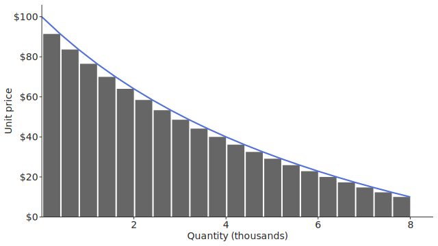

# Value creation and value capture

#### Business strategy is built on the ideas of customer value creation and capture, which originate in microeconomics.

##### By Stephen Jones, Ph.D.
###### Updated December 2021

IF YOU WANT to make intelligent business strategies, you need to understand value creation and value capture. But that means first understanding key microeconomic principles. This article is a primer on microeconomic, value creation, and value capture principles that are foundational to strategy. 

## Industries
Industries are defined as products or services that serve the same basic customer needs. This means products in the same industry are close substitutes for each other. For example, an A&W root beer, which is in the soft drink industry, easily substitutes for a Coke or Dr. Pepper, even though a customer might prefer one over the other. And a flight on Spirit Airlines can easily substitute for a flight on Alaska or Delta Airlines, even though the service may be worse. 

Industries define the boundaries of market competition, so it’s important that an industry is defined correctly to identify true rivals. For instance, should a Starbucks chilled frappuccino sold in Safeway be considered part of the soft drink industry? Yes, as long as customers see a ready-to-drink coffee and a Coke as close substitutes. This makes Coke and Starbucks rivals for at least a portion of the Starbucks product line. 

Industries can be placed on a continuum based on the level of competition within them. At one end of the continuum are perfectly competitive markets, and at the other end are monopolies. Perfectly competitive markets have many buyers and sellers, and firms are price takers, which means they accept the market price and cannot influence it. Commodities, such as sugar or rubber, are good examples of markets that approach perfect competition. At the other end of the continuum, monopoly markets consist of only one firm and have no competition, which allows the firm to set the price for the industry. Because of their power, monopolies are regulated in the U.S. For example, [PacifiCorp](https://www.pacificorp.com/) is an electric power generator and distributor that operates in six Western states. Because of its monopolies in the communities it serves, PacifiCorp is regulated by state-level public utility commissions.

At the two extremes of the continuum, the scope of potential business strategies is restricted. In (near) perfectly competitive markets, firms are limited to strategies focused on operational efficiency to keep costs as low as possible. In monopoly markets, most strategies deal with political and regulatory questions. But in all other industries between these two extremes there is a broad array of potential business strategies. This middle ground is where we will focus.

Two industry types that sit between the extremes are monopolistic competition and oligopolies. Industries with monopolistic competition have less rivalry and higher barriers to entry than perfectly competitive markets. However, these industries are not a form of monopoly; there is still intense competition. They are called “monopolistic” because companies differentiate their products enough for each product to have its own distinctive demand curve. The global apparel industry is an example of monopolistic competition. Some of the largest brands are Nike, H&M, and Zara, a Spanish fast fashion retailer, but they comprise only a small part of the trillion-dollar industry. Their dominance gives them power to influence prices, but it is limited by many rivals in an intensely competitive market. 

[Oligopolies](https://en.wikipedia.org/wiki/Oligopoly) sit between industries with monopolistic competition and monopolies. They are markets with only a few large players and high barriers to entry. Oligopolists’ products are also differentiated and have their own demand curves. The U.S. mobile telecom industry is an example: Verizon, AT&T, and T-Mobile held [99% of the market share](https://www.statista.com/statistics/199359/market-share-of-wireless-carriers-in-the-us-by-subscriptions/) in 2021. Competition is limited in oligopolies, and firms have the potential to [tacitly collude](https://www.tutor2u.net/economics/reference/oligopoly-tacit-collusion) to raise prices.

## Demand for differentiated products
When a firm differentiates its product (through branding or adding unique features or services), customers are unable to directly compare the product to rivals’ products. Because the product is somewhat distinct, a firm can set a selling price and production quantity based on the product’s unique demand curve. The price and quantity are normally chosen with the goal to maximize profit. The demand curve represents the aggregate of customers’ willingness to pay for the product. 

To illustrate this point, imagine that we own a firm that sells “thneeds”, [the fictitious multipurpose garment in Dr. Seuss’s _The Lorax_](https://www.youtube.com/watch?v=PQk3hZwN9fo). Our firm’s thneeds are differentiated in the marketplace through branding and unique styling, so the product has its own demand curve. The thneeds provide varying levels of value (i.e., utility) to different customers, so one customer might have a lower or higher willingness to pay than another. We can group customers together that have similar levels of willingness to pay. Assuming that we can estimate customers’ willingness to pay, we can consider different prices for a thneed and project how many customers will buy one. Figure 1 shows the results of this hypothetical estimate. The y-axis is the price of a thneed, and the x-axis is the quantity demanded (i.e., the number of customers willing to pay that price). At $100, no customers will buy the product. At $91, we estimate 400 individuals are willing to buy a thneed. At $84, an additional 400 individuals are willing to buy one. As the price falls, more and more customers perceive the value of the product as worth the price such that at $10, we estimate 8,000 customers are willing to buy a thneed.

## Maximizing profit

We must choose a price and production level for our thneeds that will maximize economic profit.<a href="#end-1">1</a> (Assume we are not engaged in <a href="https://www.investopedia.com/terms/p/price_discrimination.asp">price discrimination</a>.) Figure 2 illustrates our range of choices. The first column depicts revenues at different prices and production levels. The second column depicts costs. And the third column combines revenues and costs to depict profits.

Each row presents a slightly different view of revenues, costs, and profits. The first row depicts per unit or average values. The second row depicts total values (per unit values multiplied by the quantity, which is why the second row is shown in thousands of dollars). The third row depicts marginal or incremental values. Marginal values represent the change in revenue, cost, or profit when increasing production by one unit. 

To illustrate our alternatives, I have chosen three prices and production levels to analyze:  $76 at q1 = 1,240 units, $18 at q2 = 6,670 units, and $49 at q* = 3,200 units. The third production level is coined q* because it is the price at which total profit is greatest. 

### Revenues
In the upper-left corner of Figure 2, plot 1 replicates the demand curve of Figure 1. The shaded area depicts the total revenue at q*, which is $49 × 3200 = $158,600. Just below plot 1, plot 4 depicts the total revenue at any given price. At q1 the total revenue is $94,240. This is lower than the total revenue at q*, even though the price is higher, because the quantity demanded is lower. At q2 the total revenue is $120,060. This is lower than the total revenue at q* because the price is lower, even though the quantity is higher. 

In the bottom-left corner, plot 7 depicts the marginal revenues, or, the added revenue when increasing production by one unit (given a baseline production level). The marginal revenue curve in plot 7 represents the slope at a given point on the total revenue curve in plot 4. For example, at q1 the marginal revenue is $55, meaning that increasing production from 1,240 to 1,241 units would add $55 to the total revenue. At q2 the marginal revenue is −$26 because producing one more unit decreases the total revenue. At q* the marginal revenue is $12. This means that producing one more unit would increase revenue — indeed, producing another 800 units would maximize revenue — but such a decision would not maximize profit, as I will detail later.

### Costs
Total costs are depicted in plot 5 (middle). They consist of fixed costs (the solid grey horizontal line) and variable costs (the grey curve). In the short term, variable costs increase as production increases, but fixed costs remain stable. (Both types of costs adjust in the long term.) At any production level, the fixed cost is $22,000. Variable costs increase at different rates depending on the production level. When production is low, variable costs increase slowly because of labor efficiencies or volume discounts for raw materials. At higher production levels, variable costs increase quickly because of coordination costs, such as additional layers of management or more complex workflows. Total costs follow the curvature of variable costs, but are shifted higher to account for fixed costs. At q* in plot 5, the total cost is $60,800.

Just above plot 5, plot 2 depicts the average fixed, variable, and total costs at different production levels, also known as costs per unit. Because fixed costs do not change, average fixed costs (per unit) decrease as production increases. Average variable costs also drop initially but then rise at higher production levels because costs of coordination begin to compound. The average total cost is the sum of the average fixed and variable costs. At a production quantity of q1 = 1,240, the average total cost is $34 (per unit). At q* = 3,200, the average total cost drops to $19, which indicates the firm gains economies of scale. At q2 = 6,670, the ATC rises slightly to $20, which indicates diseconomies of scale. The shaded area captures the total cost at q*, which is $19 × 3,200 = $60,800, and is also depicted in plot 5. 

At the bottom middle, plot 8 depicts the marginal cost at different production levels. The marginal cost is the incremental cost of producing one more unit (given a baseline production level). It also represents the slope of the total cost curve in plot 5. Fixed costs do not affect marginal costs (in the short term); only variable costs do. For example, at q1 the marginal cost of increasing production from 1,240 to 1,241 units is $7. At q* the marginal cost of producing one more unit is $12. 

### Profits
The most direct way to maximize profits is depicted in plot 6 (middle right), which combines plots 4 and 5 (total revenues and total costs). Profit is maximized at the point where total revenues is the greatest distance above total costs. In plot 6, this is at q*: total revenue is $156,800, total cost is $60,800, and total profit is $156,800 − $60,800 = $96,000. Notice that q* is a production level that is lower than where revenue is greatest (4,000 units). This is because total revenues level off while total costs continue to increase.

Notice also that in plot 9 (lower right), marginal revenue (blue) equals marginal cost (red) at the same point at which total profits are maximized in plot 6. This is always the case, and it is one of the benefits of using marginal revenues and costs: they easily identify where profit is greatest. Why is that the case? Plot 9 graphs the slope of the revenue and cost curves in Plot 6 (the curves’ first derivatives). As long as the revenue curve in Plot 6 is sloping upward more than the cost curve, increasing production will increase the distance between the two curves and increase profit. But as soon as the cost curve’s slope catches up with the revenue curve’s slope, any additional production will start to decrease profits. Thus, the point at which the revenue and cost curves’ slopes are equal is the point at which profits are greatest. Because Plot 9 is simply a depiction of these two curves’ slopes, it clearly identifies when the slopes are equal.

In the upper right, plot 3 depicts average profits (per unit). In plot 3, to maximize profit, the firm must maximize the shaded area, which occurs at quantity q*. The height of the shaded area is the average profit (per unit) at q*, or $49 − $19 = $30. The width of the shaded area is the quantity, or 3,200 units. Thus, plot 3 also shows that the total profit is $30 × 3,200 = $96,000 at q*. 

When marginal revenue equals marginal cost (in plot 9), then total revenue is the greatest distance above total cost (in plot 6) and the shaded profit area is maximized in plot 3. This analysis suggests we should set a sales price of $49 per thneed to maximize profits.

## Value creation

Customer value<a href="#end-2">2</a> is the aggregate value that customers place on products in an industry. It is expressed as customers’ willingness to pay for a product within the industry instead of buying a substitute product from a different industry. Customer value is bounded by the aggregate production of all firms in an industry. Figure 3 shows a demand curve (D) that is the aggregation of customers’ willingness to pay for products within the industry. The quantity (Q) is aggregate production in the industry. The shaded area (a) is the total customer value in the industry. The area under D and to the right of Q is not included as customer value because no firms serve those customers. Stated differently, firms don’t price their products low enough to bring those customers into the market, so their value is not realized.

Customer value is created when the industry demand curve shifts outward and upward (D′) or when aggregate production increases (Q′), as illustrated in Figure 3. Industry demand curve D′ depicts a future state of demand. And quantity Q′ depicts an increase in aggregate production. The industry demand curve could shift to D′ if firms improved their products to better meet the needs of customers. If firms didn’t expand production (leaving Q as is), then the shift to D′ would create value in area (b). Instead, if aggregate demand remained at D but firms lowered their costs and prices to bring price-conscious customers into the market — which could increase production to Q′ — then the increased production would create value in area (c). Or if firms improved their products and lowered their prices, then the move would create value in areas (b), (c), and (d). 

All of these examples credit the creation of value to firms’ actions. But value can also be created through environmental changes, such as macroeconomic conditions, demographic trends, or customer tastes. For example, an aging population and a trend toward caring for chronic conditions at home have led to explosive growth in the home-healthcare services industry. At the beginning of 2019, the Centers for Medicare and Medicaid Services (CMS) [projected spending growth of 6.8%](https://homehealthcarenews.com/2019/02/home-health-spending-rate-projected-to-surpass-all-other-care-categories/) for the year — faster than all other areas of the healthcare sector. This growth represents a shift in the demand curve and will increase customer value as firms expand their services.

It is important to note that firms do not create customer value if they do not shift the industry demand curve or drive an increase in aggregate production. So, for example, if a firm enters a competitive industry with a product and cost structure that’s no different from rivals, the firm would not shift the demand curve. It’s not offering anything new that would create additional value for customers. Nor is it changing the value of the industry’s products relative to substitutes from other industries. Moreover, after an initial flurry of responses to the new entrant, the industry’s aggregate production may remain unchanged. 

Also note that shifts in the industry demand curve, not firm-specific demand curves, illustrate customer value creation. An industry demand curve captures customers’ willingness to pay for an industry’s products over substitutes from a different industry. But a firm-specific demand curve captures customers’ willingness to pay for a firm’s products instead of rivals’ products within the industry. Thus, shifts in a firm-specific demand curve do not always equal value creation; in some situations they only represent changes in value capture. For example, an inferior firm may leave an industry, which will shift outward a superior firm’s demand curve. Yet, there may be no shift in the aggregate industry demand curve. But at other times, a firm’s demand curve shift may correspond to an industry demand curve shift. For example, if a firm launches a new superior product, not only can it steal intra-industry demand from rivals, but it can also attract new customers to the industry. When this happens, the industry demand curve shifts outward.

## Value capture
Customer value can be captured by any entity in the chain of value creation. This includes customers, firms, suppliers, employees, governments, etc. For example, if a firm has a monopoly, its demand curve is also the industry demand curve (see Figure 4). The monopolist’s goal is to maximize profit, so it sets its price at p* and production level at quantity q*, where the average total cost (ATC) is c*. The difference between p* and c* is the firm’s profit per unit. 

The area under the demand curve up to quantity q* represents the total value created in the industry. The blue shaded area is the value captured by the customer. This is called the “consumer surplus”. The green shaded area is the value captured by the firm, which is the firm’s profit. The red shaded area is the value captured by suppliers, employees, governments, and others in the value chain. It comprises the firm’s explicit costs (e.g., paying suppliers for raw materials, compensating employees for their labor, paying taxes to governments) and implicit costs (e.g., the implied rate of return expected by shareholders). 

### Differentiation
A firm is able to capture value when it differentiates itself in ways that customers find valuable. If a firm’s product is differentiated, it’s hard for customers to compare prices with rivals’ substitute products. And without direct comparisons, it’s less likely that competition will lower prices in the market.

This is illustrated by an example of new entrants competing in a monopolist’s market. Figure 5 shows two possible scenarios. In Scenario 1, two new entrants introduce products that are nearly identical to the original monopolist’s product, as illustrated by the Venn diagram in the upper right. In Scenario 2, two new entrants introduce nearly identical products but the monopolist pivots to differentiate its product from the new rivals’ products. The product differentiation may include brand cachet, unique features, extraordinary quality, distinctive customer support, or other attributes.

Both scenarios present the original demand curve D for the monopolist and the profit-maximizing price p* and production level q*. The large light-green area depicts the original profit ([p* − c*] × q*). But in both scenarios, because of the new competition, customers’ willingness to pay falls and the monopolist’s demand curve D shifts to the left. To maximize profit under the now-shifted demand curve D′, the monopolist lowers its production to q′ and lowers its price to p′. Its average total cost per unit also increases somewhat to c′. The smaller dark-green area depicts the new profit. 

Although the shifts in demand, price, quantity, and cost are in the same direction for both scenarios, the shifts are more severe in Scenario 1. This is because the products from the three firms are so similar. Nearly all economic profits disappear, which aligns with economic theory: as distinctions dissipate in monopolistic competition, a firm’s demand curve will shift to the left. It may shift left until it intersects with the average total cost curve and the firm earns zero economic profit. In Scenario 2, the leftward shift of the demand curve is not as severe. This is because the monopolist pivoted to differentiate its product from the new entrants’ products. This allowed the monopolist to retain higher prices and production.

### Low cost
Even if a firm’s product isn’t differentiated, it can capture value by lowering its average total cost below the ATC of rivals. Depending on the shape of the lowered ATC curve, a firm may either (1) leave the price and quantity the same and simply capture more profit or (2) lower the price and increase production, which brings more price-conscious customers into the market, creates customer value, and captures more profit. This is illustrated in Figure 6.

Figure 6 begins with Scenario 1 of Figure 5 (where there are multiple firms in the industry with similar products) and depicts how profits improve when the ATC lowers. Example 1 depicts the effect of lower fixed costs, which shift the ATC curve down but don’t affect the curvature. Lower fixed costs also don’t affect the marginal cost curve, so marginal cost and marginal revenue intersect at the same quantity q*. This leads to an increase in profit as the cost per unit shifts from c* to c′ while price p* and quantity q* remain the same. 

In contrast, Example 2 depicts the effect of lower variable costs. Lower variable costs flatten the ATC curve and shift the intersection of marginal cost and marginal revenue. The firm can maximize profit by lowering its price to p′ and increasing production to q′. The firm creates value for price-conscious customers by attracting them to the market, and if no rivals in the industry provide products at this lower price, then the firm solely captures the value. Existing customers also capture more value as consumer surplus because the price is lower.

To capture value from a lower ATC, firms must maintain their low-cost advantage over rivals. If a firm lowers its ATC but rivals are able to copy the firm’s lower costs, then market competition will shift the firm’s demand curve left and any profits will disappear. The benefits of the lower ATC will be captured by customers. In contrast, if the firm introduces cost savings into its operations that are difficult to imitate, then rivals will not be able to lower their prices without incurring losses. Thus, the firm’s demand curve is insulated from additional shifts if others cannot match the firm’s costs.

---

<a href="#note-1">1.</a> It’s important to note that we are discussing economic profits, not accounting profits. Accounting profits start with revenues and subtract explicit costs (e.g., labor, depreciation, taxes), but they don’t subtract implicit opportunity costs. In contrast, economic profits account for both explicit and implicit costs. The implicit cost here is the cost of capital; in other words, the return that investors expect on the capital they invested in a firm. Thus, accounting profits may be positive even when economic profits are zero.

<a href="#note-2">2.</a> The ideas I present about value creation and capture are based on <a href="https://doi.org/10.1111/j.1430-9134.1996.00005.x">work by Adam Brandenburger and Harborne Stuart</a>, two economists who began applying cooperative game theory to business strategy in the 1990s.
